CSS教程
===
#### CSS 概述
 * CSS 指层叠样式表 (Cascading Style Sheets)
 * 样式定义如何显示 HTML 元素
 * 样式通常存储在样式表中
 * 把样式添加到 HTML 4.0 中，是为了解决内容与表现分离的问题
   * 外部样式表可以极大提高工作效率
   * 外部样式表通常存储在 CSS 文件中
   * 多个样式定义可层叠为一,就近原则

#### CSS 基础语法

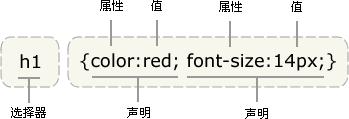

##### 选择器的分组

你可以对选择器进行分组，这样，被分组的选择器就可以分享相同的声明。用逗号将需要分组的选择器分开

`h1,h2,h3,h4,h5,h6 {
  color: green;
  }` 
  
#### CSS选择器

* 通用选择器
* 标签选择器
* 派生选择器
* id选择器
* 类选择器
* 子元素选择器
* 后代选择器
* 相邻兄弟选择器
* 普通兄弟选择器

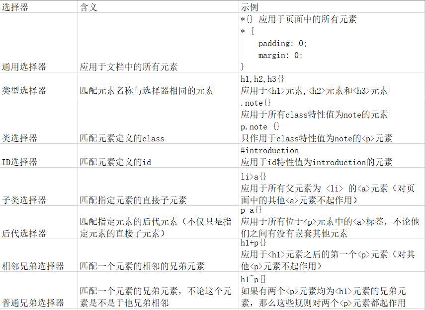

>> id选择器

* id 选择器可以为标有特定 id 的 HTML 元素指定特定的样式。
* id 选择器以 "#" 来定义。

#### css引入方式

* 外部样式表

  * `<link rel="stylesheet" type="text/css" href="mystyle.css" />`

* 内部样式表

  * ``

* 内联样式

  * `style="color: sienna; margin-left: 20px"`
  
#### CSS规则如何级联
如果有两个或者更多的规则应用在同一个元素上，那么理解这些规则的优先级关系是非常重要的。
* 就近原则
  * 如果两个选择器完全相同，那么后出现的选择器优先级较高。
* 具体性原则
  * 如果一个选择器比其他选择器更加具体，那么具体的选择器优先于一般的选择器
* 重要性
  * 你可以在任意属性值后面添加!important来强调这个规则比应用于同一元素的其他规则更重要
  
##### css样式属性

 * 字体属性
 
   >> 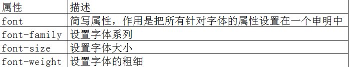
   
   >>font-style:斜体 该属性有三个值可选，normal：正常字体；italic：使文本以斜体显示；oblique：是文本以倾斜显示
   
 * 文本属性
   >> 文字一行显示，多出部分自动隐藏
   
   >>> overflow: hidden; 内容超出后隐藏
   
   >>> text-overflow: ellipsis;超出内容显示为省略号
   
   >>> white-space: nowrap; 文本不进行换行
 
   >> 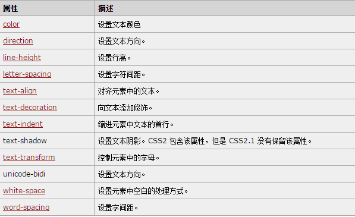
   
   >> text-transform可选三个值，uppercase：文本以大写显示，lowercase:文本以小写显示；capitalize：每个单词的首字母以大写显示
   
   >> text-decoration； none：应用在文本上的装饰线删除； underline：在文本底部增加一条实线；overline：在顶部增加一条实线；line-through：一条实线穿过文字；blink：使文本动态闪烁
   
   >> 行间距:line-height
  
   >> 单词之间的距离  word-spacing
 *  边框相关属性
   >> border-radius 圆角边框
   >> 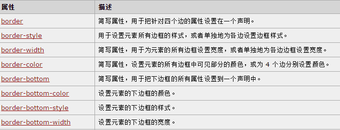
   
   >> 空单元格的边框  empty-cells： show：显示空单元格的边框   hide：隐藏空单元格的边框  inherit：如果一个表格嵌套在另一个表格中，那么inherit值表明单元格遵循外部表格的规则
   
   >> border-spacing  该属性通常用像数来表示。
   
   >> border-collapse  collapse：单元格相邻边框合并（这时boder-spacing empty-cells会被忽略） separate：相邻单元格分离（border-spacing属性会生效）
   
 * > 背景相关属性
 
   >> 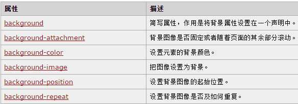
 

 * 列表标签属性
 
   >> 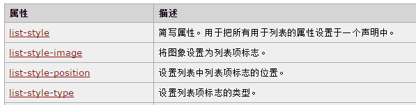
   
   >>> list-style-type类型
   
   >>> 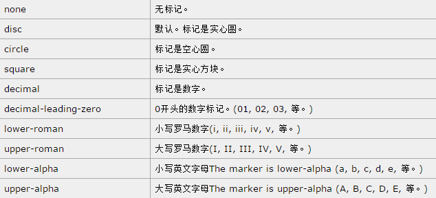
   
 * box-shadow 阴影
   >> box-shadow:-5px -5px #777
   
   >> 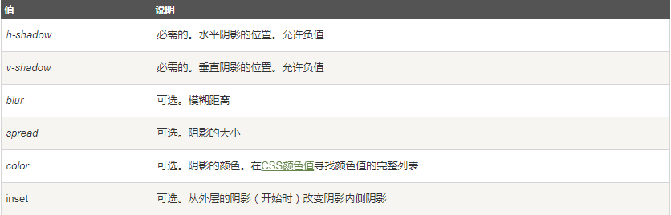
   
   >> 水平偏移：负值表示将阴影置于盒子的左侧
   
   >> 垂直偏移：负值表示阴影置于盒子的上方
   
 * transform
   >> 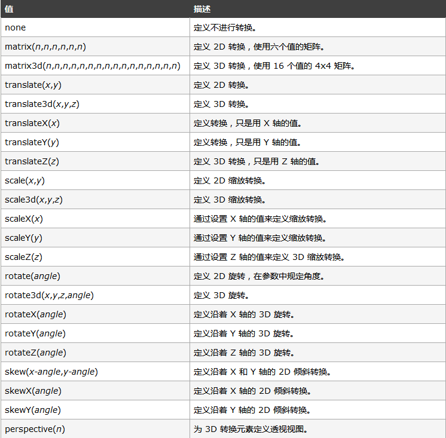
   
 * 伪类
   >> :link:该伪类允许你为那些尚未访问过的链接设置样式
   
   >> :visited：该伪类允许你为那些尚未访问过的链接设置样式
   
   >> :hover:该伪类在用户将光标悬停于某个元素上时生效
   
   >> :active:该伪类在用户在元素上进行操作的时候生效
   
   >> ：focus：该伪类在元素拥有焦点的时候生效
   
 * 行标签和快标签之前转化
   >> display inline:块级标签表现的像行标签。blockL:行标签表现的像快标签， inline-block：使一个块级元素像行级元素那样浮动并保持其他的块级元素的特征；none：将一个元素从页面上隐藏
   
 * 隐藏
   >> visibility 其值有：hidden，visible 
 
 * cursor
   >> 用来控制显示给用户的光标类型其值有auto,crosshair,default,pointer,move,text,wait,help,url()
   
#### css布局-盒子模型
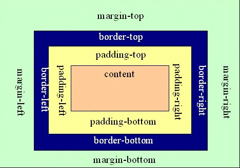

#### 浮动

* float：设置值为left，right，none；当设置元素向左或者向右浮动时，元素会像其父元素的左侧和右侧靠紧；（在文字排版布局经常用到，尤其重要）
* 清除浮动 
  * clear：both； clear：right； clear：left；
  * overflow：hidden
  
#### css布局定位
* position：制定块的位置，即块相对于其父级的位置和相对自身应该在的位置。
  * position:absolute(绝对定位),当子块的position设置为absolute时，子块已经不再属于父块，其左框设置的距离是相对页面的body的距离，而不是父块的距离。（子块不属于父块）
  * position：relative（相对定位），与将其设置为absolute完全不同，这时相对于自身在父块的原先位置来进行定位。（子块任然属于父块）
  * position：fixed（固定定位），生成绝对定位的元素，相对于浏览器窗口进行定位。元素的位置通过 "left", "top", "right" 以及 "bottom" 属性进行规定。
  * z-index：用来调整定位时重叠块的上下位置，默认值为0.
  
>>> 相对与绝对定位区别

>>>> 包含属性：relative（相对） absolute（绝对）

>>>> * position:relative; 如果对一个元素进行相对定位，首先它将出现在它所在的位置上。然后通过设置垂直或水平位置，让这个元素"相对于"它的原始起点进行移动。（再一点，相对定位时，无论是否进行移动，元素仍然占据原来的空间。因此，移动元素会导致它覆盖其他框）

>>>> * position:absolute; 表示绝对定位，位置将依据浏览器左上角开始计算。 绝对定位使元素脱离文档流，因此不占据空间。普通文档流中元素的布局就像绝对定位的元素不存在时一样。（因为绝对定位的框与文档流无关，所以它们可以覆盖页面上的其他元素并可以通过z-index来控制它层级次序。z-index的值越高，它显示的越在上层。）

>>>> * 父容器使用相对定位，子元素使用绝对定位后，这样子元素的位置不再相对于浏览器左上角，而是相对于父容器左上角(相对于最近定位的父级元素)_**

>>>> * 相对定位和绝对定位需要配合top、right、bottom、left使用来定位具体位置，这四个属性只有在该元素使用定位后才生效，其它情况下无效。另外这四个属性同时只能使用相邻的两个，不能即使用上又使用下，或即使用左，又使用右

#### CSS3:透明度
* opacity（0.0~1.0）
* css3中的rgba属性允许你像RGB值那样指定颜色，在增加一个透明度的值（0.0~1.0），例如rgba(0，0，0，0.5)

####CSS3：颜色表示的方式
* rgb值：用0~255之间的数字表示红，绿，蓝三种颜色的值  rgb(102,205,170)
* 十六进制编码    #000000
* 颜色的名称
* hsl：hsl颜色属性已经作为一种新的颜色指定方式引入到css3，该属性的值以hsl开头，位于其后的括号内是以下几种值
hsl(0,0%,78%)
  * 色调：通过介于0~360之间的角度表示
  * 饱和度：通过百分比数表示
  * 透明度：通过百分数表示。0%表示黑色，50%表示标准色，100%表示白色
* hsla(hsla(0,100%,100%,0.5))
  * 色调：通过介于0~360之间的角度表示
  * 饱和度：通过百分比数表示
  * 透明度：通过百分数表示。0%表示黑色，50%表示标准色，100%表示白色
  * ALPHA:透明度 该值由介于0~1.0之间的数字表示

