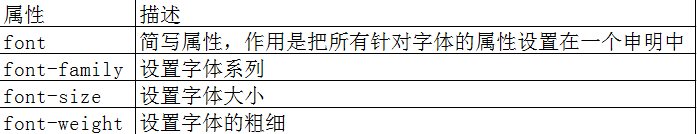
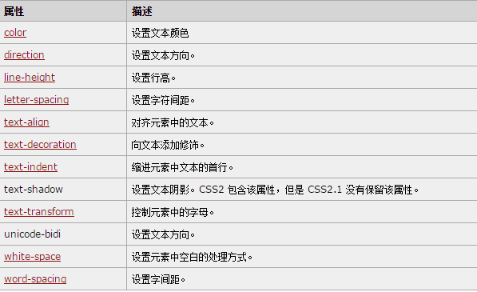
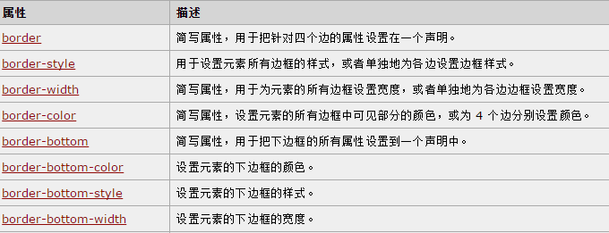
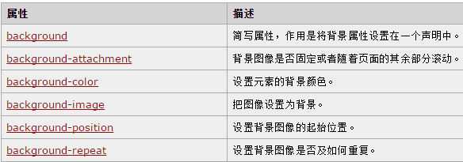
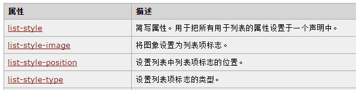
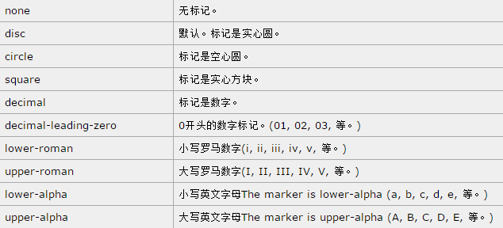
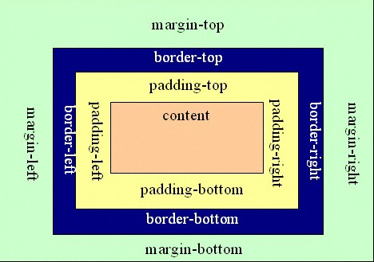

CSS教程
===
#### CSS 概述
 * CSS 指层叠样式表 (Cascading Style Sheets)
 * 样式定义如何显示 HTML 元素
 * 样式通常存储在样式表中
 * 把样式添加到 HTML 4.0 中，是为了解决内容与表现分离的问题
   * 外部样式表可以极大提高工作效率
   * 外部样式表通常存储在 CSS 文件中
   * 多个样式定义可层叠为一,就近原则

#### CSS 基础语法

##### 选择器的分组

你可以对选择器进行分组，这样，被分组的选择器就可以分享相同的声明。用逗号将需要分组的选择器分开

`h1,h2,h3,h4,h5,h6 {
  color: green;
  }`
  
#### 选择器

* 标签选择器
* 派生选择器
* id选择器
* 类选择器

>> id选择器

* id 选择器可以为标有特定 id 的 HTML 元素指定特定的样式。
* id 选择器以 "#" 来定义。

#### css引入方式

* 外部样式表

  * `<link rel="stylesheet" type="text/css" href="mystyle.css" />`

* 内部样式表

  * ``

* 内联样式

  * `style="color: sienna; margin-left: 20px"`
  
##### css样式属性

 * > 字体属性
 
   >> 
   
 * > 文本属性
 
   >> 
 
 * > 边框相关属性
   >> border-radius 圆角边框
   >> 
   
 * > 背景相关属性
 
   >> 

 * 列表标签属性
 
   >> 
   
   >>> list-style-type类型
   
   >>> 
   
#### css布局-盒子模型

#### 浮动

* float：设置值为left，right，none；当设置元素向左或者向右浮动时，元素会像其父元素的左侧和右侧靠紧；（在文字排版布局经常用到，尤其重要）
* 清除浮动 
  * clear：both； clear：right； clear：left；
  * overflow：hidden
  
#### css布局定位
* position：制定块的位置，即块相对于其父级的位置和相对自身应该在的位置。
  * position:absolute(绝对定位),当子块的position设置为absolute时，子块已经不再属于父块，其左框设置的距离是相对页面的body的距离，而不是父块的距离。（子块不属于父块）
  * position：relative（相对定位），与将其设置为absolute完全不同，这时相对于自身在父块的原先位置来进行定位。（子块任然属于父块）
  * position：fixed（固定定位），生成绝对定位的元素，相对于浏览器窗口进行定位。元素的位置通过 "left", "top", "right" 以及 "bottom" 属性进行规定。
  * z-index：用来调整定位时重叠块的上下位置，默认值为0.
  
>>> 相对与绝对定位区别

>>>> 包含属性：relative（相对） absolute（绝对）
>>>> * position:relative; 如果对一个元素进行相对定位，首先它将出现在它所在的位置上。然后通过设置垂直或水平位置，让这个元素"相对于"它的原始起点进行移动。（再一点，相对定位时，无论是否进行移动，元素仍然占据原来的空间。因此，移动元素会导致它覆盖其他框）
>>>> * position:absolute; 表示绝对定位，位置将依据浏览器左上角开始计算。 绝对定位使元素脱离文档流，因此不占据空间。普通文档流中元素的布局就像绝对定位的元素不存在时一样。（因为绝对定位的框与文档流无关，所以它们可以覆盖页面上的其他元素并可以通过z-index来控制它层级次序。z-index的值越高，它显示的越在上层。）
>>>> * **_父容器使用相对定位，子元素使用绝对定位后，这样子元素的位置不再相对于浏览器左上角，而是相对于父容器左上角(相对于最近定位的父级元素)_**
>>>> * 相对定位和绝对定位需要配合top、right、bottom、left使用来定位具体位置，这四个属性只有在该元素使用定位后才生效，其它情况下无效。另外这四个属性同时只能使用相邻的两个，不能即使用上又使用下，或即使用左，又使用右

